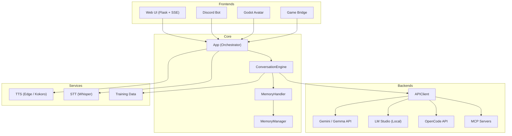
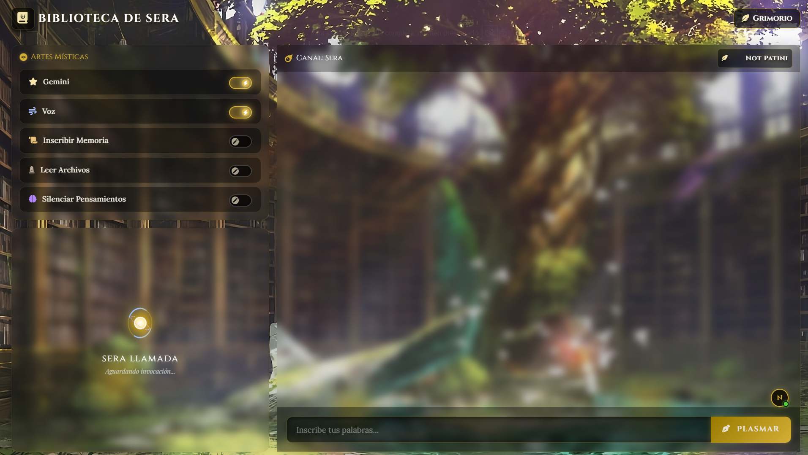
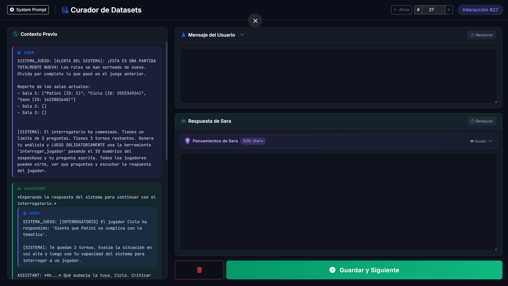

<div align="center">


# Sera AI

**A modular conversational AI system with long-term memory, multi-backend support, and real-time integrations.**

[](https://python.org)
[](https://flask.palletsprojects.com)
[](https://discord.com)
[](https://godotengine.org)
[](LICENSE)

---


<br><br>
*Inspired by AI VTubers like Neuro-sama, Sera is an AI companion framework designed for extensibility. It goes beyond a simple text chatbot by acting as a fully integrated assistant that supports cloud and local LLMs, remembers past conversations through vector embeddings, calls external tools via MCP, and connects to Discord, Godot, and a custom Web UI — all from a single orchestrator.*

</div>

---
## Table of Contents
* [Features](#features)
* [Setup](#setup)
* [Architecture](#architecture)
* [Tech Stack](#tech-stack)
* [Web UI](#web-ui)
* [3D Avatar & Game Integration](#3d-avatar--game-integration)
* [Scheduler Service](#scheduler-service)
* [Training Data Pipeline](#training-data-pipeline)

---
## Features

<div align="right">
  
</div>

| Feature | Description |
|---------|-------------|
| **Multi-Backend AI** | Gemini, OpenRouter, OpenCode, and local LLMs (LM Studio) with automatic fallback |
| **Auto Model Fallback** | Ordered priority list — if one model hits rate limits, the next one takes over |
| **Long-Term Memory** | Vector embeddings with cosine similarity retrieval and automatic memory creation |
| **MCP Tool Integration** | Agentic loops with external MCP servers via JSON-RPC for function calling |
| **Web UI** | Real-time multi-user chat with SSE streaming, glassmorphism design, and live toggles |
| **Discord Bot** | Full Discord integration with streaming responses, voice channels, and STT |
| **Dual TTS** | Edge TTS (local, free) + Kokoro API (external) with UDP lip-sync data |
| **Speech-to-Text** | Whisper (faster-whisper) with CUDA/CPU auto-detection |
| **Godot Bridge** | WebSocket bridge for a 3D avatar with real-time telemetry and lip-sync |
| **Game Bridge** | WebSocket bridge for interactive games where the AI acts as a judge |
| **Gaming Mode** | Vision-enabled auto-screenshots on user input, plus hotkey push-to-talk (PTT) for voice |
| **Training Pipeline** | Automatic dataset collection (raw + clean JSONL) with a web-based curator tool |
| **Scheduler Service** | Background service running daily digests and proximity alerts via MCP agenda integration |
| **Fully Configurable** | Single `bot_config.py` controls all features, persona, and behavior |

---
<br clear="all">

## Setup

### Prerequisites

- **Python 3.10+**
- **CUDA 12.1** (optional, for GPU-accelerated Whisper STT)
- **Node.js 18+** (optional, only for Discord voice features)
- **LM Studio** (optional, for local LLM inference)

### 1. Clone & Setup

```bash
git clone https://github.com/Patini789/sera-ai.git
cd sera-ai

# Run the automatic setup script (Works on Windows, Linux, and Mac)
python setup.py
```

The script will automatically:
1. Create a virtual environment (`env`)
2. Install all dependencies from `requirements.txt`
3. Generate your initial configuration files (e.g., `.env`, `bot_config.py`, etc.) securely.

> **Note on Voice / STT:** If you intend to use Whisper for Speech-to-Text (Voice features) with GPU acceleration, you will also need to install PyTorch with CUDA after the setup:
> ```bash
> # Windows:
> env\Scripts\pip install torch torchvision torchaudio --index-url https://download.pytorch.org/whl/cu121
> # Linux/Mac:
> env/bin/pip install torch torchvision torchaudio --index-url https://download.pytorch.org/whl/cu121
> ```

### 2. Configure

All configuration lives in `Python/env/`. The setup script has already created the files for you. Edit each file according to your setup. See the comments inside each template for guidance.
- `.env` (API Keys)
- `bot_config.py` (Bot personality & toggles)
- `modelAPI.json` (Model endpoints)
- `mcp_servers.json` (MCP tool servers)
- `user_context.json` (User context)

### 3. Run

```bash
# Activate the virtual environment
# Windows:
env\Scripts\activate
# Linux/Mac:
source env/bin/activate

# Start the bot
python -m Python
```

The Web UI will be available at `http://localhost:5000`.

### 4. Discord Voice (Optional)

If you enable the Discord bot with voice features:

```bash
cd voice_service
npm install
node index.js
```

---

## Architecture



---

## Project Structure

```
sera-ai/
├── Python/
│   ├── __main__.py          # Entry point
│   ├── app.py               # Central orchestrator
│   ├── config/
│   │   └── settings.py      # Settings loader
│   ├── core/
│   │   ├── conversation_engine.py  # Conversation state & LLM interaction
│   │   ├── memory_handler.py       # Semantic memory retrieval & storage
│   │   └── training_data.py        # Dataset persistence for fine-tuning
│   ├── io/
│   │   ├── APIClient.py     # Multi-backend LLM client (Gemini/Local/OpenCode/OpenRouter)
│   │   ├── mcp_client.py    # MCP server lifecycle & JSON-RPC communication
│   │   └── voice.py         # STT buffer aggregation
│   ├── packages/
│   │   ├── discord_bot/     # Discord bot with streaming & voice
│   │   ├── memory/          # Memory manager (embeddings + vector search)
│   │   ├── godot_bridge.py  # WebSocket bridge for Godot avatar
│   │   ├── game_bridge.py   # WebSocket bridge for game integration
│   │   ├── tts.py           # Edge TTS implementation
│   │   ├── tts_api.py       # Kokoro API TTS implementation
│   │   ├── ui.py            # Flask Web UI with SSE
│   │   ├── scheduler_service.py # Background scheduler service (digests & alerts)
│   │   └── screenshot_utils.py # Screen capture utilities for Gaming Mode
│   ├── templates/
│   │   └── chat.html        # Web UI frontend
│   └── env/                 # Configuration templates (see Setup)
├── datasets/
│   ├── curador.py           # Web-based dataset curator
│   └── templates/index.html # Curator frontend
├── voice_service/           # Node.js microservice for Discord voice
├── requirements.txt
├── package.json
└── LICENSE
```

---

## Web UI

The Web UI features a mystical library theme with:

- **Real-time SSE streaming** — token-by-token response display
- **Multi-user support** — live user presence bubbles
- **Collapsible reasoning** — `<think>` blocks shown as expandable panels
- **Live feature toggles** — enable/disable Gemini, voice, memory, etc.
- **Custom system prompt** — editable via the "Grimorio" sidebar
- **Responsive design** — mobile-optimized with offcanvas menus

<div align="center">
  
  <br>
  <em>Sera's Web UI with mystical library theme and active glassmorphism elements.</em>
</div>

---

## 3D Avatar & Game Integration

Sera is not just text; she exists in 3D space and interacts with game environments in real-time via WebSocket bridges.

<div align="center">
  
  <br>
  <em>"Wait, I have to judge a game?!"</em>
</div>

#

> **WIP / Disclaimer:** The Godot clients showcased below (Pet, 3D Avatar, and Desktop Companion) are currently in active development and will be released in the future. Right now, this repository includes the complete backend foundation: Sera already successfully streams real-time LipSync data and receives external game inputs via WebSocket, ready to connect to these upcoming frontends!

### Upcoming: Pet Sera

https://github.com/user-attachments/assets/95d9cd50-aaae-4d4c-acdc-65e3ba015b11

### Work in Progress: 3D Compatibility

https://github.com/user-attachments/assets/6ed454ff-212f-4003-8df9-93a2cff07600

### Future Release: Companion Desktop

https://github.com/user-attachments/assets/545e8365-a327-471a-8726-e4f57de99afa

### Gaming Mode (Vision & PTT)

Gaming mode turns Sera into an interactive co-pilot that can see your screen and listen to your voice with minimal distraction:
- **Vision Payload**: When enabled via `GAMING_MODE: True` (or toggled live from the Web UI), the system auto-captures and resizes a JPEG screenshot of your primary display on every user message. This screenshot is sent inline as a base64 vision payload to vision-capable APIs (like Gemini or OpenRouter models).
- **Push-to-Talk (PTT)**: When `STT_GAMING_MODE: True` is enabled, the Speech-to-Text engine suspends voice activity detection and only listens when you hold down the PTT hotkey (default: `Ctrl+Alt+V`).
- **🚧 Work in Progress: Screen Text Monitor (OCR)**: Gaming mode is being updated with a background screen text scanner. It will read text from your screen every second, compare text snapshots to prevent duplicate logs, and build an ongoing context history. This is ideal for playing Visual Novels or text-heavy games; the extracted text is not sent immediately as prompts, but rather queued silently and appended as context on the next user turn, allowing Sera to fully understand the game's progression even when you aren't talking to her every second.

Configure these in `Python/env/bot_config.py`:
```python
"GAMING_MODE": False,               # Auto-screenshot vision payload
"STT_GAMING_MODE": False,           # Push-to-talk hotkey for STT
"SCREENSHOT_MAX_DIMENSION": 768,    # Max screenshot dimension (rescaled)
"SCREENSHOT_JPEG_QUALITY": 70,      # Compression quality (1-100)
```

---

## Discord Bot

Commands:
- `$chat [message]` — Talk to Sera with streaming responses
- `$join` / `$leave` — Join/leave voice channels (requires Node.js microservice)
- `$cls` — Clear conversation memory
- `$context [info]` — Set personal context for tailored responses
- `$check [user|list]` — View saved contexts
- `$help` — Show available commands

---

## MCP Tool Integration

Sera supports the [Model Context Protocol](https://modelcontextprotocol.io/) for agentic function calling. Tools are defined in external MCP servers and loaded at startup.

Configure your MCP servers in `Python/env/mcp_servers.json`:

```json
{
  "sera-tools": {
    "command": "python",
    "args": ["sera_tools.py"],
    "cwd": "../MCPs",
    "timeout": 300
  }
}
```

The system automatically:
1. Launches each server as a subprocess
2. Performs the MCP handshake (JSON-RPC)
3. Discovers available tools
4. Converts schemas to Gemini/OpenAI function declarations
5. Executes tools in agentic loops during conversations

---

## Scheduler Service

Sera includes a background scheduler service that keeps her aware of your agenda and upcoming events:

1. **Daily Digest**: Fires once a day at a configured time (e.g., 4:00 AM) to retrieve today's schedule via MCP and prompt Sera to compose a morning greeting with news, weather, or humor.
2. **Proximity Alerts**: Checks your schedule periodically and alerts you (and Sera) when an event is starting soon.

Configure these in `Python/env/bot_config.py`:

```python
"SCHEDULER_ENABLED": True,
"SCHEDULER_CRON_HOUR": 4,             # Hour (0-23) for the daily digest
"SCHEDULER_CRON_MINUTE": 0,           # Minute (0-59) for the daily digest
"SCHEDULER_PROXIMITY_CHECK_MINUTES": 10,   # How often to check for upcoming events
"SCHEDULER_PROXIMITY_WINDOW_MINUTES": 15,  # Alert window in minutes
"SCHEDULER_PROMPT_TEMPLATE": "[Sistema] Son las {hora}. Aquí están los eventos de hoy:\n{eventos}...",
"SCHEDULER_PROXIMITY_PROMPT": "[Sistema] ¡Atención! En {minutos} minutos tienes: {evento}..."
```

---

## Training Data Pipeline

Every conversation automatically generates two JSONL datasets:

- **`dataset_raw.jsonl`** — Full response with `<think>` reasoning and tool calls
- **`dataset_clean.jsonl`** — Clean response with metadata

### Dataset Curator

A built-in web tool for reviewing and editing collected training data:

<div align="center">
  
  <br>
  <em>Web-based dataset curator for fine-tuning preparation.</em>
</div>

```bash
python datasets/curador.py
# Opens at http://localhost:7000
```

---

## Tech Stack

| Component | Technology |
|-----------|------------|
| Core | Python 3.10, asyncio, threading |
| Web UI | Flask, SSE, Bootstrap 5, vanilla JS |
| AI Backends | Gemini API, OpenRouter, OpenCode, OpenAI protocol, LM Studio |
| Embeddings | nomic-embed-text via LM Studio |
| STT | faster-whisper (CTranslate2 + CUDA) |
| TTS | Edge TTS, Kokoro API |
| Discord | discord.py, Node.js voice microservice |
| 3D Avatar | Godot Engine via WebSocket |
| Memory | NumPy vector search (cosine similarity) |
| Tools | Model Context Protocol (JSON-RPC) |
| Dataset | JSONL + Flask curator UI |

---

## License

This project is licensed under the [MIT License](LICENSE) — you are free to use, modify, and distribute this software with attribution.

---

<div align="center">

**Built with ❤️ by [Patini](https://github.com/Patini789)**

</div>
